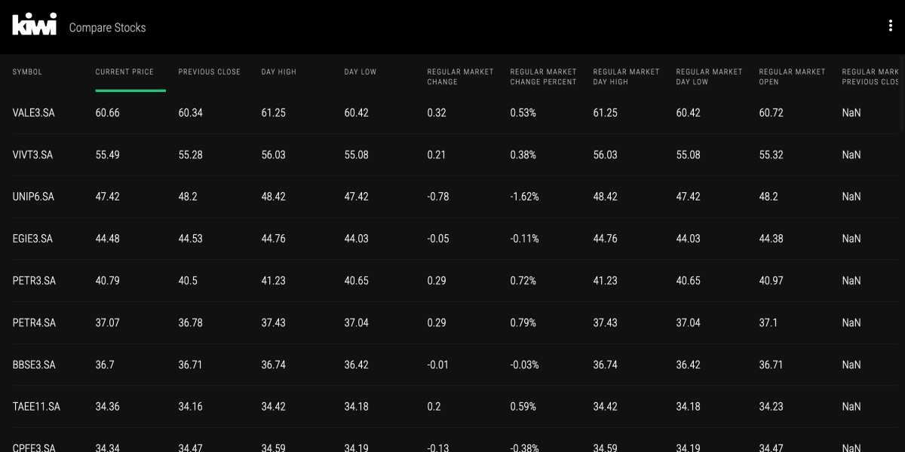
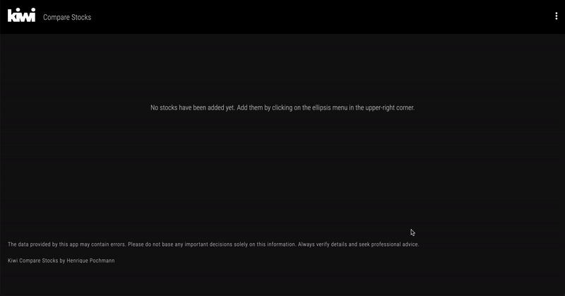

# Kiwi Stocks | Web App

## Description

Kiwi Stocks is a simple way to compare and track stock indicators.

Currently, only companies listed on [B3's IDIV stock index](https://www.b3.com.br/en_us/market-data-and-indices/indices/indices-de-segmentos-e-setoriais/dividend-index-idiv-composition-index-portfolio.htm) are available. Users can get information on 48 Brazilian companies through 55 indicators.

The data is fetched via [Yahu Financials API](https://rapidapi.com/apidojo/api/yahoo-finance1) and stored in a database on Supabase. Data updates occur twice a week via a cron job on Vercel.

## Screenshot



## Demo


[Check out the project](https://kiwistocks.vercel.app/)

## Installation and Usage

1.   Clone the repository:

     ```sh
     git clone https://github.com/henriquepcm/kiwi-stocks.git
     ```

2.   Access the directory:

     ```sh
     cd kiwi-stocks
     ```

3.   Install Dependencies:
     ```sh
     npm i
     ```
4.   Create a file for environment variables.

     Create a file named `.env.local` in the root folder of the project, and add to it the following environment variables with their respective values. You should get these values from [Supabase](https://supabase.com/), [RapidApi](https://rapidapi.com/apidojo/api/yahoo-finance1), and [Google Analytics](https://developers.google.com/analytics).

     ```sh
     NEXT_PUBLIC_SUPABASE_URL="value"

     NEXT_PUBLIC_SUPABASE_ANON_KEY="value"

     NEXT_PUBLIC_GOOGLE_ANALYTICS_ID="value"

     RAPIDAPI_KEY="value"

     SUPABASE_SERVICE_ROLE_KEY="value"
     ```

5.   Run Next.js:

     ```sh
     npm run dev
     ```

6.   Completion:
     -    You should now be all set to use the project.

## Features

-    Add or remove stock symbols from the database
-    Hide or display indicators
-    User preferences are stored in the browser's localStorage
-    Data is updated twice a week
-    Sticky lists for symbols and indicators while scrolling
-    Filter the list by clicking on indicators
-    Responsive design

## Technologies

-    Cron job (Vercel)
-    ESLint
-    Font Awesome
-    GitHub Actions (CI pipeline)
-    Jest
-    Next.js
-    Prettier
-    React
-    React Testing Library
-    Redux
-    Supabase
-    Tailwind CSS
-    TypeScript
-    UUID
-    Yahu Financials RESTful API
-    Zod

## License

This project is licensed under the [MIT License](LICENSE.md).

## Credits

Created by Henrique Pochmann.

## Contact

You can reach out to me via [LinkedIn](https://www.linkedin.com/in/henriquepcm/) or henriquepcm@gmail.com.
